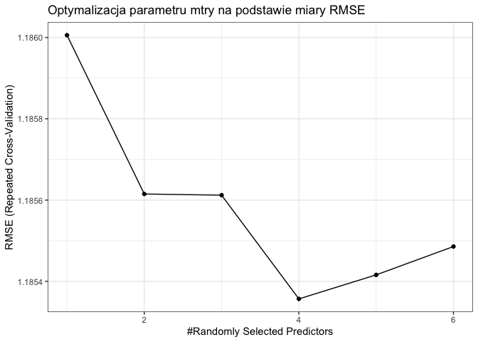
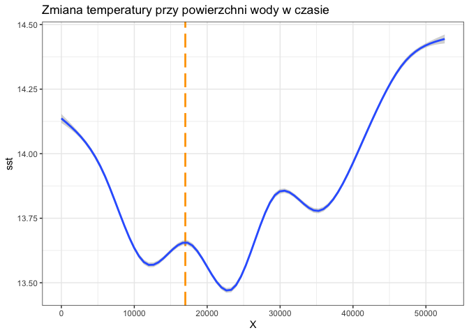

-   [Wstęp](#wstęp)
-   [Podsumowanie analizy](#podsumowanie-analizy)
-   [Przygotowanie bibliotek i
    danych](#przygotowanie-bibliotek-i-danych)
    -   [Wczytanie bibliotek](#wczytanie-bibliotek)
    -   [Zapewnienie powtarzalności
        wyników](#zapewnienie-powtarzalności-wyników)
    -   [Wczytanie danych](#wczytanie-danych)
    -   [Opis wczytanych atrybutów](#opis-wczytanych-atrybutów)
-   [Analiza rozkładu atrybutów](#analiza-rozkładu-atrybutów)
-   [Uzupełnienie pustych danych](#uzupełnienie-pustych-danych)
    -   [Analiza rozkładu atrybutów](#analiza-rozkładu-atrybutów-1)
    -   [Analiza rozkładu wartości
        atrybutów](#analiza-rozkładu-wartości-atrybutów)
-   [Analiza korelacji atrybutów](#analiza-korelacji-atrybutów)
-   [Prezentacja interaktywnego wykresu zmiany długości złowionego
    śledzia w
    czasie](#prezentacja-interaktywnego-wykresu-zmiany-długości-złowionego-śledzia-w-czasie)
-   [Regresor przewidujący długość złowionego
    śledzia](#regresor-przewidujący-długość-złowionego-śledzia)
-   [Analiza ważności atrybutów](#analiza-ważności-atrybutów)
-   [Wnioski](#wnioski)

Wstęp
=====

Celem projektu jest analiza zbioru danych dotyczących połowu śledzia
oceanicznego w Europie oraz próba określenia głównych przyczyn
stopniowego zmniejszania się długości śledzi. Pomiary zawierają
obserwacje z ostatnich 60 lat. Wiersze są uporządkowane chronologicznie.

Zbiór danych zawiera 52582 obserwacji opisanych 16 cechami.

Podsumowanie analizy
====================

Podczas analizy, ze zbioru, usunięte zostały wartości brakujące.
Usnięcie wartości pustych zostało dokonane częściowo poprzez wyliczenie
miedany ze zbioru podobnego, a tam gdzie nie udało się znaleźć takiego
zbioru całe z dalszej analizy został wykreślony cały wiersz.
Przeprowadzona została interpretacja wartości cech i korelacji między
nimi. W trakcie badań zależności określono, że długość śledzia jest
powiązana w dużym stopniu ze zmianą temperatury przy powierzchni wody. W
kolejnym kroku utworzony został model predykcji długości ryby w postaci
regresora za pomocą algorytmu RandomForest. W projekcie zbadano ważność
atrybutów podczas predykcji, co pomogło określić przyczyny spadku
długości śledzia wyławianego w Europie:

-   wzrost temperatury przy powierzchni wody
-   spadek liczby widłonogów

Przygotowanie bibliotek i danych
================================

W tej części następuje załadowanie wykorzystanych w projekcie bibliotek
i wczytanie danych

Wczytanie bibliotek
-------------------

``` r
library(knitr)       # report generation
library(dplyr)       # data manipulation
library(ggplot2)     # plots visualisation
library(gridExtra)   # multiple plots on grid
library(ggcorrplot)  # correlation matrix visualisation
library(plotly)      # interactive plots
library(caret)       # data exploration lib
library(randomForest)# rf
library(tidyr)
```

Zapewnienie powtarzalności wyników
----------------------------------

``` r
set.seed(69)
```

Wczytanie danych
----------------

``` r
sledzie <- read.csv("sledzie.csv", na.strings = "?")
```

Opis wczytanych atrybutów
-------------------------

<table>
<colgroup>
<col style="width: 16%" />
<col style="width: 83%" />
</colgroup>
<thead>
<tr class="header">
<th>Nazwa atrybutu</th>
<th>Opis</th>
</tr>
</thead>
<tbody>
<tr class="odd">
<td>length</td>
<td>długość złowionego śledzia [cm]</td>
</tr>
<tr class="even">
<td>cfin1</td>
<td>dostępność planktonu [zagęszczenie Calanus finmarchicus gat. 1]</td>
</tr>
<tr class="odd">
<td>cfin2</td>
<td>dostępność planktonu [zagęszczenie Calanus finmarchicus gat. 2]</td>
</tr>
<tr class="even">
<td>chel1</td>
<td>dostępność planktonu [zagęszczenie Calanus helgolandicus gat. 1]</td>
</tr>
<tr class="odd">
<td>chel2</td>
<td>dostępność planktonu [zagęszczenie Calanus helgolandicus gat. 2]</td>
</tr>
<tr class="even">
<td>lcop1</td>
<td>dostępność planktonu [zagęszczenie widłonogów gat. 1]</td>
</tr>
<tr class="odd">
<td>lcop2</td>
<td>dostępność planktonu [zagęszczenie widłonogów gat. 2]</td>
</tr>
<tr class="even">
<td>fbar</td>
<td>natężenie połowów w regionie [ułamek pozostawionego narybku]</td>
</tr>
<tr class="odd">
<td>recr</td>
<td>roczny narybek [liczba śledzi]</td>
</tr>
<tr class="even">
<td>cumf</td>
<td>łączne roczne natężenie połowów w regionie [ułamek pozostawionego narybku]</td>
</tr>
<tr class="odd">
<td>totaln</td>
<td>łączna liczba ryb złowionych w ramach połowu [liczba śledzi]</td>
</tr>
<tr class="even">
<td>sst</td>
<td>temperatura przy powierzchni wody [°C]</td>
</tr>
<tr class="odd">
<td>sal</td>
<td>poziom zasolenia wody [Knudsen ppt]</td>
</tr>
<tr class="even">
<td>xmonth</td>
<td>miesiąc połowu [numer miesiąca]</td>
</tr>
<tr class="odd">
<td>nao</td>
<td>oscylacja północnoatlantycka [mb]</td>
</tr>
</tbody>
</table>

Analiza rozkładu atrybutów
==========================

``` r
summary(sledzie[-1])
```

    ##      length         cfin1             cfin2             chel1       
    ##  Min.   :19.0   Min.   : 0.0000   Min.   : 0.0000   Min.   : 0.000  
    ##  1st Qu.:24.0   1st Qu.: 0.0000   1st Qu.: 0.2778   1st Qu.: 2.469  
    ##  Median :25.5   Median : 0.1111   Median : 0.7012   Median : 5.750  
    ##  Mean   :25.3   Mean   : 0.4458   Mean   : 2.0248   Mean   :10.006  
    ##  3rd Qu.:26.5   3rd Qu.: 0.3333   3rd Qu.: 1.7936   3rd Qu.:11.500  
    ##  Max.   :32.5   Max.   :37.6667   Max.   :19.3958   Max.   :75.000  
    ##                 NA's   :1581      NA's   :1536      NA's   :1555    
    ##      chel2            lcop1              lcop2             fbar       
    ##  Min.   : 5.238   Min.   :  0.3074   Min.   : 7.849   Min.   :0.0680  
    ##  1st Qu.:13.427   1st Qu.:  2.5479   1st Qu.:17.808   1st Qu.:0.2270  
    ##  Median :21.673   Median :  7.0000   Median :24.859   Median :0.3320  
    ##  Mean   :21.221   Mean   : 12.8108   Mean   :28.419   Mean   :0.3304  
    ##  3rd Qu.:27.193   3rd Qu.: 21.2315   3rd Qu.:37.232   3rd Qu.:0.4560  
    ##  Max.   :57.706   Max.   :115.5833   Max.   :68.736   Max.   :0.8490  
    ##  NA's   :1556     NA's   :1653       NA's   :1591                     
    ##       recr              cumf             totaln             sst       
    ##  Min.   : 140515   Min.   :0.06833   Min.   : 144137   Min.   :12.77  
    ##  1st Qu.: 360061   1st Qu.:0.14809   1st Qu.: 306068   1st Qu.:13.60  
    ##  Median : 421391   Median :0.23191   Median : 539558   Median :13.86  
    ##  Mean   : 520366   Mean   :0.22981   Mean   : 514973   Mean   :13.87  
    ##  3rd Qu.: 724151   3rd Qu.:0.29803   3rd Qu.: 730351   3rd Qu.:14.16  
    ##  Max.   :1565890   Max.   :0.39801   Max.   :1015595   Max.   :14.73  
    ##                                                        NA's   :1584   
    ##       sal            xmonth            nao          
    ##  Min.   :35.40   Min.   : 1.000   Min.   :-4.89000  
    ##  1st Qu.:35.51   1st Qu.: 5.000   1st Qu.:-1.89000  
    ##  Median :35.51   Median : 8.000   Median : 0.20000  
    ##  Mean   :35.51   Mean   : 7.258   Mean   :-0.09236  
    ##  3rd Qu.:35.52   3rd Qu.: 9.000   3rd Qu.: 1.63000  
    ##  Max.   :35.61   Max.   :12.000   Max.   : 5.08000  
    ## 

Uzupełnienie pustych danych
===========================

Zbiór danych opisujący połów śledzi zawiera 10094 niepełnych obserwacji.
Cały zbiór składa się z 52582 pomiarów. W przypadku jeśli odrzucenia
wszystkich niepełnych pomiarów utracilibyśmy zbyt dużo istotnych
informacji.

Na podstawie wstępnej analizy atrybutów można zauważyć, że brakujące
wartości występują w cechach opisujących:

-   dostępność planktonu (cfin1, cfin2, chel1, chel2, lcop1, lcop2),
-   temperaturę przy powierzchni wody (sst).

W zbiorze danych można zauważyć, że wartości atrybutów często występują
w podobnych grupach. W zbiorze danych warto zwrócić uwagę, że wartości
atrybutów najczęściej występują w podobnych grupach. Dla przedstawienia
tej zależności wybrano przykładowe trzy podzbiory sąsiadujących ze sobą
elementów:

``` r
sledzie[c(1:8, 200:215), ]
```

    ##       X length   cfin1   cfin2   chel1    chel2   lcop1    lcop2  fbar   recr
    ## 1     0   23.0 0.02778 0.27785 2.46875       NA 2.54787 26.35881 0.356 482831
    ## 2     1   22.5 0.02778 0.27785 2.46875 21.43548 2.54787 26.35881 0.356 482831
    ## 3     2   25.0 0.02778 0.27785 2.46875 21.43548 2.54787 26.35881 0.356 482831
    ## 4     3   25.5 0.02778 0.27785 2.46875 21.43548 2.54787 26.35881 0.356 482831
    ## 5     4   24.0 0.02778 0.27785 2.46875 21.43548 2.54787 26.35881 0.356 482831
    ## 6     5   22.0 0.02778 0.27785 2.46875 21.43548 2.54787       NA 0.356 482831
    ## 7     6   24.0 0.02778 0.27785 2.46875 21.43548 2.54787 26.35881 0.356 482831
    ## 8     7   23.5 0.02778 0.27785 2.46875 21.43548 2.54787 26.35881 0.356 482831
    ## 200 199   23.5 0.02778 0.27785 2.46875 21.43548 2.54787 26.35881 0.356 482831
    ## 201 200   21.0      NA 0.27785 2.46875 21.43548 2.54787 26.35881 0.356 482831
    ## 202 201   23.0 0.02778 0.27785 2.46875 21.43548 2.54787 26.35881 0.356 482831
    ## 203 202   20.5 0.02778      NA 2.46875 21.43548 2.54787 26.35881 0.356 482831
    ## 204 203   20.5 0.02778 0.27785 2.46875 21.43548 2.54787 26.35881 0.356 482831
    ## 205 204   24.0 0.02778 0.27785      NA 21.43548 2.54787 26.35881 0.356 482831
    ## 206 205   21.0      NA 0.27785 2.46875 21.43548 2.54787 26.35881 0.356 482831
    ## 207 206   20.5 0.02778 0.27785 2.46875 21.43548 2.54787 26.35881 0.356 482831
    ## 208 207   24.0 0.02778 0.27785 2.46875 21.43548 2.54787 26.35881 0.356 482831
    ## 209 208   21.0 0.02778 0.27785 2.46875 21.43548 2.54787 26.35881 0.356 482831
    ## 210 209   21.0 0.02778 0.27785 2.46875 21.43548 2.54787 26.35881 0.356 482831
    ## 211 210   23.0 0.02778 0.27785 2.46875 21.43548 2.54787 26.35881 0.356 482831
    ## 212 211   23.0 0.02778 0.27785 2.46875 21.43548 2.54787 26.35881 0.356 482831
    ## 213 212   21.5 0.02778 0.27785 2.46875 21.43548 2.54787 26.35881 0.356 482831
    ## 214 213   21.5 0.02778      NA 2.46875 21.43548      NA 26.35881 0.356 482831
    ## 215 214   21.5 0.02778 0.27785 2.46875 21.43548 2.54787 26.35881 0.356 482831
    ##          cumf   totaln      sst      sal xmonth nao
    ## 1   0.3059879 267380.8 14.30693 35.51234      7 2.8
    ## 2   0.3059879 267380.8 14.30693 35.51234      7 2.8
    ## 3   0.3059879 267380.8 14.30693 35.51234      7 2.8
    ## 4   0.3059879 267380.8 14.30693 35.51234      7 2.8
    ## 5   0.3059879 267380.8 14.30693 35.51234      7 2.8
    ## 6   0.3059879 267380.8 14.30693 35.51234      7 2.8
    ## 7   0.3059879 267380.8 14.30693 35.51234      7 2.8
    ## 8   0.3059879 267380.8 14.30693 35.51234      7 2.8
    ## 200 0.3059879 267380.8 14.30693 35.51234      9 2.8
    ## 201 0.3059879 267380.8 14.30693 35.51234      9 2.8
    ## 202 0.3059879 267380.8 14.30693 35.51234      9 2.8
    ## 203 0.3059879 267380.8 14.30693 35.51234      9 2.8
    ## 204 0.3059879 267380.8 14.30693 35.51234      9 2.8
    ## 205 0.3059879 267380.8 14.30693 35.51234      9 2.8
    ## 206 0.3059879 267380.8 14.30693 35.51234      9 2.8
    ## 207 0.3059879 267380.8 14.30693 35.51234      9 2.8
    ## 208 0.3059879 267380.8 14.30693 35.51234      9 2.8
    ## 209 0.3059879 267380.8 14.30693 35.51234      9 2.8
    ## 210 0.3059879 267380.8 14.30693 35.51234      9 2.8
    ## 211 0.3059879 267380.8 14.30693 35.51234      9 2.8
    ## 212 0.3059879 267380.8 14.30693 35.51234      9 2.8
    ## 213 0.3059879 267380.8 14.30693 35.51234      9 2.8
    ## 214 0.3059879 267380.8 14.30693 35.51234      9 2.8
    ## 215 0.3059879 267380.8 14.30693 35.51234      9 2.8

Założyć można, że brakujące elementy mają zawsze taką samą wartość jak
sąsiadujące obok wiersze.

Dlatego do uzupełnienia wartości pustych w wierszach zostanie użyty
algorytm sprawdzający podobieństwo wierszy. Następnie po znalezieniu
podobnych wierszy wartość pusta zostanie uzupełniona medianą
znalezionych wierszy.

Dla wierszy gdzie nie udało się znaleźć podobieństw zostaną one usunięte
z dalszej analizy.

``` r
sledzieFilled <- sledzie

planktonAttributesNames <- c("cfin1", "cfin2", "chel1", "chel2", "lcop1", "lcop2")
missingAttributes <- c(planktonAttributesNames, "sst")

for (missingValue in missingAttributes) {
  df <- sledzie[is.na(sledzie[[missingValue]]), ]
  if (nrow(df) == 0) { next }
  planktonAttributesToFilter <- planktonAttributesNames[planktonAttributesNames != missingValue]

  for(i in 1:nrow(df)) {
    row <- df[i,]

    if (missingValue == "sst") {
      similarGroups <- sledzie[
        sledzie$totaln == row$totaln &
        sledzie$sal == row$sal &
        sledzie$xmonth == row$xmonth &
        sledzie$nao == row$nao, ]
    } else {
      similarGroups <- sledzie[
        sledzie[[planktonAttributesToFilter[1]]] == row[[planktonAttributesToFilter[1]]] &
        sledzie[[planktonAttributesToFilter[2]]] == row[[planktonAttributesToFilter[2]]] &
        sledzie[[planktonAttributesToFilter[3]]] == row[[planktonAttributesToFilter[3]]] &
        sledzie[[planktonAttributesToFilter[4]]] == row[[planktonAttributesToFilter[4]]] &
        sledzie[[planktonAttributesToFilter[5]]] == row[[planktonAttributesToFilter[5]]]
        , ]
    }
    sledzieFilled[sledzieFilled$X == row$X,][[missingValue]] <- median(similarGroups[[missingValue]], na.rm = TRUE)
  }
}

sledzieFilled <- sledzieFilled[complete.cases(sledzieFilled), ]
```

Analiza rozkładu atrybutów
--------------------------

``` r
summary(sledzieFilled[-1])
```

    ##      length         cfin1             cfin2             chel1       
    ##  Min.   :19.0   Min.   : 0.0000   Min.   : 0.0000   Min.   : 0.000  
    ##  1st Qu.:24.0   1st Qu.: 0.0000   1st Qu.: 0.2778   1st Qu.: 2.469  
    ##  Median :25.5   Median : 0.1111   Median : 0.7012   Median : 5.750  
    ##  Mean   :25.3   Mean   : 0.4460   Mean   : 2.0272   Mean   :10.003  
    ##  3rd Qu.:26.5   3rd Qu.: 0.3333   3rd Qu.: 1.7936   3rd Qu.:11.500  
    ##  Max.   :32.5   Max.   :37.6667   Max.   :19.3958   Max.   :75.000  
    ##      chel2            lcop1              lcop2             fbar       
    ##  Min.   : 5.238   Min.   :  0.3074   Min.   : 7.849   Min.   :0.0680  
    ##  1st Qu.:13.427   1st Qu.:  2.5479   1st Qu.:17.808   1st Qu.:0.2270  
    ##  Median :21.435   Median :  7.0000   Median :24.859   Median :0.3320  
    ##  Mean   :21.219   Mean   : 12.8064   Mean   :28.424   Mean   :0.3303  
    ##  3rd Qu.:27.193   3rd Qu.: 21.2315   3rd Qu.:37.232   3rd Qu.:0.4560  
    ##  Max.   :57.706   Max.   :115.5833   Max.   :68.736   Max.   :0.8490  
    ##       recr              cumf             totaln             sst       
    ##  Min.   : 140515   Min.   :0.06833   Min.   : 144137   Min.   :12.77  
    ##  1st Qu.: 360061   1st Qu.:0.14809   1st Qu.: 306068   1st Qu.:13.60  
    ##  Median : 421391   Median :0.23191   Median : 539558   Median :13.86  
    ##  Mean   : 520202   Mean   :0.22979   Mean   : 514975   Mean   :13.88  
    ##  3rd Qu.: 724151   3rd Qu.:0.29803   3rd Qu.: 730351   3rd Qu.:14.16  
    ##  Max.   :1565890   Max.   :0.39801   Max.   :1015595   Max.   :14.73  
    ##       sal            xmonth            nao          
    ##  Min.   :35.40   Min.   : 1.000   Min.   :-4.89000  
    ##  1st Qu.:35.51   1st Qu.: 5.000   1st Qu.:-1.89000  
    ##  Median :35.51   Median : 8.000   Median : 0.20000  
    ##  Mean   :35.51   Mean   : 7.258   Mean   :-0.09208  
    ##  3rd Qu.:35.52   3rd Qu.: 9.000   3rd Qu.: 1.63000  
    ##  Max.   :35.61   Max.   :12.000   Max.   : 5.08000

Analiza rozkładu wartości atrybutów
-----------------------------------


Analiza korelacji atrybutów
===========================

``` r
corMatrix <- cor(sledzieFilled[, -1])
ggcorrplot(corMatrix,  type = "lower", outline.col = "white") + ggtitle("Korelacja atrybutów")
```


Na wykresie można zauważyć silną korelację ujemną między długością
śledzia (length), a temperaturą przy powierzchni (sst).

``` r
ggplot(sledzieFilled, aes(x=sst, y=length)) + 
  ggtitle("Zmiana długości złowionego śledzia w zależności od temperatory przy powierzchni wody") + 
  geom_smooth() + 
  theme_bw()
```


Prezentacja interaktywnego wykresu zmiany długości złowionego śledzia w czasie
==============================================================================

``` r
partition <- createDataPartition(y=sledzieFilled$length, p=.05, list=FALSE)
dfPartition <- sledzieFilled[partition, ]
p <- ggplot(dfPartition, aes(x=X, y=length)) + 
  ggtitle("Zmiana długości złowionego śledzia w czasie") + 
  geom_smooth() + 
  theme_bw()
ggplotly(p)
```

<!--html_preserve-->

<script type="application/json" data-for="htmlwidget-824a38f7094f7ed31734">{"x":{"data":[{"x":[9,674.46835443038,1339.93670886076,2005.40506329114,2670.87341772152,3336.3417721519,4001.81012658228,4667.27848101266,5332.74683544304,5998.21518987342,6663.6835443038,7329.15189873418,7994.62025316456,8660.08860759494,9325.55696202532,9991.0253164557,10656.4936708861,11321.9620253165,11987.4303797468,12652.8987341772,13318.3670886076,13983.835443038,14649.3037974684,15314.7721518987,15980.2405063291,16645.7088607595,17311.1772151899,17976.6455696203,18642.1139240506,19307.582278481,19973.0506329114,20638.5189873418,21303.9873417722,21969.4556962025,22634.9240506329,23300.3924050633,23965.8607594937,24631.3291139241,25296.7974683544,25962.2658227848,26627.7341772152,27293.2025316456,27958.6708860759,28624.1392405063,29289.6075949367,29955.0759493671,30620.5443037975,31286.0126582278,31951.4810126582,32616.9493670886,33282.417721519,33947.8860759494,34613.3544303797,35278.8227848101,35944.2911392405,36609.7594936709,37275.2278481013,37940.6962025316,38606.164556962,39271.6329113924,39937.1012658228,40602.5696202532,41268.0379746835,41933.5063291139,42598.9746835443,43264.4430379747,43929.9113924051,44595.3797468354,45260.8481012658,45926.3164556962,46591.7848101266,47257.253164557,47922.7215189873,48588.1898734177,49253.6582278481,49919.1265822785,50584.5949367089,51250.0632911392,51915.5316455696,52581],"y":[24.3445989410824,24.4993904037883,24.6527530886468,24.8032582178106,24.9494770134322,25.0899806976643,25.2233404926596,25.3481276205706,25.4629133035499,25.5665339636447,25.659809763341,25.7444593616887,25.8222058608323,25.894772362916,25.9638819700842,26.0312577844812,26.0986229082514,26.167700443539,26.2401931111396,26.3160321264155,26.3920299587563,26.464681920527,26.5304833240923,26.5859294818172,26.6275157060665,26.651737309205,26.6550896035977,26.634067902254,26.5867413857513,26.5173349839911,26.4315784057991,26.3352013600013,26.2339335554235,26.1335047008915,26.0396445052313,25.9580826772688,25.8945074986986,25.8511502762794,25.8242352383478,25.8093858266597,25.8022254829707,25.7983776490365,25.7934657666129,25.7831132774555,25.76294362332,25.7286495287157,25.6787041035209,25.6152434401689,25.5406536496502,25.4573208429552,25.3676311310743,25.273970624998,25.1787254357167,25.0842816544574,24.9926317760739,24.904364552799,24.8197559268156,24.7390818403065,24.6626182354544,24.5906410544422,24.5234262394527,24.4612497326686,24.4043874762728,24.3530006594192,24.3066049901568,24.2644906642577,24.2259476415605,24.1902658819036,24.1567353451258,24.1246459910656,24.0932877795616,24.0619709284914,24.0303839164837,23.9985503676931,23.96650550166,23.9342845379248,23.9019226960279,23.8694551955097,23.8369172559107,23.8043440967713],"text":["X:     9.0000<br />length: 24.34460","X:   674.4684<br />length: 24.49939","X:  1339.9367<br />length: 24.65275","X:  2005.4051<br />length: 24.80326","X:  2670.8734<br />length: 24.94948","X:  3336.3418<br />length: 25.08998","X:  4001.8101<br />length: 25.22334","X:  4667.2785<br />length: 25.34813","X:  5332.7468<br />length: 25.46291","X:  5998.2152<br />length: 25.56653","X:  6663.6835<br />length: 25.65981","X:  7329.1519<br />length: 25.74446","X:  7994.6203<br />length: 25.82221","X:  8660.0886<br />length: 25.89477","X:  9325.5570<br />length: 25.96388","X:  9991.0253<br />length: 26.03126","X: 10656.4937<br />length: 26.09862","X: 11321.9620<br />length: 26.16770","X: 11987.4304<br />length: 26.24019","X: 12652.8987<br />length: 26.31603","X: 13318.3671<br />length: 26.39203","X: 13983.8354<br />length: 26.46468","X: 14649.3038<br />length: 26.53048","X: 15314.7722<br />length: 26.58593","X: 15980.2405<br />length: 26.62752","X: 16645.7089<br />length: 26.65174","X: 17311.1772<br />length: 26.65509","X: 17976.6456<br />length: 26.63407","X: 18642.1139<br />length: 26.58674","X: 19307.5823<br />length: 26.51733","X: 19973.0506<br />length: 26.43158","X: 20638.5190<br />length: 26.33520","X: 21303.9873<br />length: 26.23393","X: 21969.4557<br />length: 26.13350","X: 22634.9241<br />length: 26.03964","X: 23300.3924<br />length: 25.95808","X: 23965.8608<br />length: 25.89451","X: 24631.3291<br />length: 25.85115","X: 25296.7975<br />length: 25.82424","X: 25962.2658<br />length: 25.80939","X: 26627.7342<br />length: 25.80223","X: 27293.2025<br />length: 25.79838","X: 27958.6709<br />length: 25.79347","X: 28624.1392<br />length: 25.78311","X: 29289.6076<br />length: 25.76294","X: 29955.0759<br />length: 25.72865","X: 30620.5443<br />length: 25.67870","X: 31286.0127<br />length: 25.61524","X: 31951.4810<br />length: 25.54065","X: 32616.9494<br />length: 25.45732","X: 33282.4177<br />length: 25.36763","X: 33947.8861<br />length: 25.27397","X: 34613.3544<br />length: 25.17873","X: 35278.8228<br />length: 25.08428","X: 35944.2911<br />length: 24.99263","X: 36609.7595<br />length: 24.90436","X: 37275.2278<br />length: 24.81976","X: 37940.6962<br />length: 24.73908","X: 38606.1646<br />length: 24.66262","X: 39271.6329<br />length: 24.59064","X: 39937.1013<br />length: 24.52343","X: 40602.5696<br />length: 24.46125","X: 41268.0380<br />length: 24.40439","X: 41933.5063<br />length: 24.35300","X: 42598.9747<br />length: 24.30660","X: 43264.4430<br />length: 24.26449","X: 43929.9114<br />length: 24.22595","X: 44595.3797<br />length: 24.19027","X: 45260.8481<br />length: 24.15674","X: 45926.3165<br />length: 24.12465","X: 46591.7848<br />length: 24.09329","X: 47257.2532<br />length: 24.06197","X: 47922.7215<br />length: 24.03038","X: 48588.1899<br />length: 23.99855","X: 49253.6582<br />length: 23.96651","X: 49919.1266<br />length: 23.93428","X: 50584.5949<br />length: 23.90192","X: 51250.0633<br />length: 23.86946","X: 51915.5316<br />length: 23.83692","X: 52581.0000<br />length: 23.80434"],"type":"scatter","mode":"lines","name":"fitted values","line":{"width":3.77952755905512,"color":"rgba(51,102,255,1)","dash":"solid"},"hoveron":"points","showlegend":false,"xaxis":"x","yaxis":"y","hoverinfo":"text","frame":null},{"x":[9,674.46835443038,1339.93670886076,2005.40506329114,2670.87341772152,3336.3417721519,4001.81012658228,4667.27848101266,5332.74683544304,5998.21518987342,6663.6835443038,7329.15189873418,7994.62025316456,8660.08860759494,9325.55696202532,9991.0253164557,10656.4936708861,11321.9620253165,11987.4303797468,12652.8987341772,13318.3670886076,13983.835443038,14649.3037974684,15314.7721518987,15980.2405063291,16645.7088607595,17311.1772151899,17976.6455696203,18642.1139240506,19307.582278481,19973.0506329114,20638.5189873418,21303.9873417722,21969.4556962025,22634.9240506329,23300.3924050633,23965.8607594937,24631.3291139241,25296.7974683544,25962.2658227848,26627.7341772152,27293.2025316456,27958.6708860759,28624.1392405063,29289.6075949367,29955.0759493671,30620.5443037975,31286.0126582278,31951.4810126582,32616.9493670886,33282.417721519,33947.8860759494,34613.3544303797,35278.8227848101,35944.2911392405,36609.7594936709,37275.2278481013,37940.6962025316,38606.164556962,39271.6329113924,39937.1012658228,40602.5696202532,41268.0379746835,41933.5063291139,42598.9746835443,43264.4430379747,43929.9113924051,44595.3797468354,45260.8481012658,45926.3164556962,46591.7848101266,47257.253164557,47922.7215189873,48588.1898734177,49253.6582278481,49919.1265822785,50584.5949367089,51250.0632911392,51915.5316455696,52581,52581,52581,51915.5316455696,51250.0632911392,50584.5949367089,49919.1265822785,49253.6582278481,48588.1898734177,47922.7215189873,47257.253164557,46591.7848101266,45926.3164556962,45260.8481012658,44595.3797468354,43929.9113924051,43264.4430379747,42598.9746835443,41933.5063291139,41268.0379746835,40602.5696202532,39937.1012658228,39271.6329113924,38606.164556962,37940.6962025316,37275.2278481013,36609.7594936709,35944.2911392405,35278.8227848101,34613.3544303797,33947.8860759494,33282.417721519,32616.9493670886,31951.4810126582,31286.0126582278,30620.5443037975,29955.0759493671,29289.6075949367,28624.1392405063,27958.6708860759,27293.2025316456,26627.7341772152,25962.2658227848,25296.7974683544,24631.3291139241,23965.8607594937,23300.3924050633,22634.9240506329,21969.4556962025,21303.9873417722,20638.5189873418,19973.0506329114,19307.582278481,18642.1139240506,17976.6455696203,17311.1772151899,16645.7088607595,15980.2405063291,15314.7721518987,14649.3037974684,13983.835443038,13318.3670886076,12652.8987341772,11987.4303797468,11321.9620253165,10656.4936708861,9991.0253164557,9325.55696202532,8660.08860759494,7994.62025316456,7329.15189873418,6663.6835443038,5998.21518987342,5332.74683544304,4667.27848101266,4001.81012658228,3336.3417721519,2670.87341772152,2005.40506329114,1339.93670886076,674.46835443038,9,9],"y":[24.0344065138015,24.2424491006202,24.4424893038357,24.6290192538799,24.7966526924867,24.9431598749148,25.0717506408433,25.188282448965,25.2973584661019,25.4011686050682,25.4998013931671,25.5919569302915,25.6757454285588,25.7498001382307,25.8147055923445,25.8736476436876,25.9315746657059,25.9938445191181,26.0652795567552,26.1466169306128,26.2320541976031,26.3144618586384,26.3866760320561,26.4428124255117,26.479568690006,26.4961298333599,26.4927544224854,26.4694271153827,26.4259507117835,26.3643073438145,26.2863943501408,26.1941612168613,26.0911906121826,25.983949223707,25.8813219427109,25.7930083705863,25.728170763947,25.6898816119041,25.6713967605153,25.6643258475087,25.6605967536158,25.6541204365363,25.6418282439852,25.6228588600256,25.5968743717106,25.5628662796607,25.5194170435619,25.4649861543022,25.3974254212585,25.3153966803737,25.2203632794594,25.1171898773245,25.0125869696658,24.9132569574343,24.8236413843006,24.7424768323194,24.6664759569355,24.5920974093234,24.5168345967861,24.4406323735249,24.3660983911518,24.2972395481501,24.2380135179183,24.1907504644767,24.1528902101617,24.1195385359884,24.085739716897,24.0483220108331,24.0074276879807,23.9659415006123,23.9275605497862,23.8952413644562,23.8689757864972,23.8453335388811,23.8185013213061,23.7813269516245,23.7289617202036,23.6618543288728,23.5838306196813,23.499015006414,23.499015006414,24.1096731871287,24.0900038921402,24.0770560621466,24.0748836718521,24.087242124225,24.1145096820138,24.1517671965051,24.1917920464703,24.2287004925267,24.2590150093369,24.2833504815189,24.3060430022709,24.3322097529742,24.366155566224,24.4094427925271,24.4603197701519,24.5152508543617,24.5707614346273,24.6252599171871,24.6807540877535,24.7406497353595,24.8084018741227,24.8860662712896,24.9730358966957,25.0662522732786,25.1616221678471,25.2553063514805,25.3448639017677,25.4307513726715,25.5148989826892,25.5992450055366,25.6838818780419,25.7655007260356,25.8379911634799,25.8944327777707,25.9290128749295,25.9433676948853,25.9451032892406,25.9426348615367,25.9438542123255,25.9544458058107,25.9770737161804,26.0124189406546,26.0608442334502,26.1231569839513,26.1979670677518,26.283060178076,26.3766764986643,26.4762415031412,26.5767624614575,26.6703626241676,26.7475320597192,26.7987086891253,26.81742478471,26.8073447850502,26.775462722127,26.7290465381227,26.6742906161285,26.6149019824155,26.5520057199095,26.4854473222182,26.4151066655239,26.3415563679598,26.2656711507968,26.1888679252749,26.113058347824,26.0397445876013,25.9686662931058,25.8969617930859,25.8198181335148,25.7318993222212,25.6284681409979,25.5079727921762,25.3749303444758,25.2368015204139,25.1023013343778,24.9774971817413,24.8630168734579,24.7563317069564,24.6547913683633,24.0344065138015],"text":["X:     9.0000<br />length: 24.34460","X:   674.4684<br />length: 24.49939","X:  1339.9367<br />length: 24.65275","X:  2005.4051<br />length: 24.80326","X:  2670.8734<br />length: 24.94948","X:  3336.3418<br />length: 25.08998","X:  4001.8101<br />length: 25.22334","X:  4667.2785<br />length: 25.34813","X:  5332.7468<br />length: 25.46291","X:  5998.2152<br />length: 25.56653","X:  6663.6835<br />length: 25.65981","X:  7329.1519<br />length: 25.74446","X:  7994.6203<br />length: 25.82221","X:  8660.0886<br />length: 25.89477","X:  9325.5570<br />length: 25.96388","X:  9991.0253<br />length: 26.03126","X: 10656.4937<br />length: 26.09862","X: 11321.9620<br />length: 26.16770","X: 11987.4304<br />length: 26.24019","X: 12652.8987<br />length: 26.31603","X: 13318.3671<br />length: 26.39203","X: 13983.8354<br />length: 26.46468","X: 14649.3038<br />length: 26.53048","X: 15314.7722<br />length: 26.58593","X: 15980.2405<br />length: 26.62752","X: 16645.7089<br />length: 26.65174","X: 17311.1772<br />length: 26.65509","X: 17976.6456<br />length: 26.63407","X: 18642.1139<br />length: 26.58674","X: 19307.5823<br />length: 26.51733","X: 19973.0506<br />length: 26.43158","X: 20638.5190<br />length: 26.33520","X: 21303.9873<br />length: 26.23393","X: 21969.4557<br />length: 26.13350","X: 22634.9241<br />length: 26.03964","X: 23300.3924<br />length: 25.95808","X: 23965.8608<br />length: 25.89451","X: 24631.3291<br />length: 25.85115","X: 25296.7975<br />length: 25.82424","X: 25962.2658<br />length: 25.80939","X: 26627.7342<br />length: 25.80223","X: 27293.2025<br />length: 25.79838","X: 27958.6709<br />length: 25.79347","X: 28624.1392<br />length: 25.78311","X: 29289.6076<br />length: 25.76294","X: 29955.0759<br />length: 25.72865","X: 30620.5443<br />length: 25.67870","X: 31286.0127<br />length: 25.61524","X: 31951.4810<br />length: 25.54065","X: 32616.9494<br />length: 25.45732","X: 33282.4177<br />length: 25.36763","X: 33947.8861<br />length: 25.27397","X: 34613.3544<br />length: 25.17873","X: 35278.8228<br />length: 25.08428","X: 35944.2911<br />length: 24.99263","X: 36609.7595<br />length: 24.90436","X: 37275.2278<br />length: 24.81976","X: 37940.6962<br />length: 24.73908","X: 38606.1646<br />length: 24.66262","X: 39271.6329<br />length: 24.59064","X: 39937.1013<br />length: 24.52343","X: 40602.5696<br />length: 24.46125","X: 41268.0380<br />length: 24.40439","X: 41933.5063<br />length: 24.35300","X: 42598.9747<br />length: 24.30660","X: 43264.4430<br />length: 24.26449","X: 43929.9114<br />length: 24.22595","X: 44595.3797<br />length: 24.19027","X: 45260.8481<br />length: 24.15674","X: 45926.3165<br />length: 24.12465","X: 46591.7848<br />length: 24.09329","X: 47257.2532<br />length: 24.06197","X: 47922.7215<br />length: 24.03038","X: 48588.1899<br />length: 23.99855","X: 49253.6582<br />length: 23.96651","X: 49919.1266<br />length: 23.93428","X: 50584.5949<br />length: 23.90192","X: 51250.0633<br />length: 23.86946","X: 51915.5316<br />length: 23.83692","X: 52581.0000<br />length: 23.80434","X: 52581.0000<br />length: 23.80434","X: 52581.0000<br />length: 23.80434","X: 51915.5316<br />length: 23.83692","X: 51250.0633<br />length: 23.86946","X: 50584.5949<br />length: 23.90192","X: 49919.1266<br />length: 23.93428","X: 49253.6582<br />length: 23.96651","X: 48588.1899<br />length: 23.99855","X: 47922.7215<br />length: 24.03038","X: 47257.2532<br />length: 24.06197","X: 46591.7848<br />length: 24.09329","X: 45926.3165<br />length: 24.12465","X: 45260.8481<br />length: 24.15674","X: 44595.3797<br />length: 24.19027","X: 43929.9114<br />length: 24.22595","X: 43264.4430<br />length: 24.26449","X: 42598.9747<br />length: 24.30660","X: 41933.5063<br />length: 24.35300","X: 41268.0380<br />length: 24.40439","X: 40602.5696<br />length: 24.46125","X: 39937.1013<br />length: 24.52343","X: 39271.6329<br />length: 24.59064","X: 38606.1646<br />length: 24.66262","X: 37940.6962<br />length: 24.73908","X: 37275.2278<br />length: 24.81976","X: 36609.7595<br />length: 24.90436","X: 35944.2911<br />length: 24.99263","X: 35278.8228<br />length: 25.08428","X: 34613.3544<br />length: 25.17873","X: 33947.8861<br />length: 25.27397","X: 33282.4177<br />length: 25.36763","X: 32616.9494<br />length: 25.45732","X: 31951.4810<br />length: 25.54065","X: 31286.0127<br />length: 25.61524","X: 30620.5443<br />length: 25.67870","X: 29955.0759<br />length: 25.72865","X: 29289.6076<br />length: 25.76294","X: 28624.1392<br />length: 25.78311","X: 27958.6709<br />length: 25.79347","X: 27293.2025<br />length: 25.79838","X: 26627.7342<br />length: 25.80223","X: 25962.2658<br />length: 25.80939","X: 25296.7975<br />length: 25.82424","X: 24631.3291<br />length: 25.85115","X: 23965.8608<br />length: 25.89451","X: 23300.3924<br />length: 25.95808","X: 22634.9241<br />length: 26.03964","X: 21969.4557<br />length: 26.13350","X: 21303.9873<br />length: 26.23393","X: 20638.5190<br />length: 26.33520","X: 19973.0506<br />length: 26.43158","X: 19307.5823<br />length: 26.51733","X: 18642.1139<br />length: 26.58674","X: 17976.6456<br />length: 26.63407","X: 17311.1772<br />length: 26.65509","X: 16645.7089<br />length: 26.65174","X: 15980.2405<br />length: 26.62752","X: 15314.7722<br />length: 26.58593","X: 14649.3038<br />length: 26.53048","X: 13983.8354<br />length: 26.46468","X: 13318.3671<br />length: 26.39203","X: 12652.8987<br />length: 26.31603","X: 11987.4304<br />length: 26.24019","X: 11321.9620<br />length: 26.16770","X: 10656.4937<br />length: 26.09862","X:  9991.0253<br />length: 26.03126","X:  9325.5570<br />length: 25.96388","X:  8660.0886<br />length: 25.89477","X:  7994.6203<br />length: 25.82221","X:  7329.1519<br />length: 25.74446","X:  6663.6835<br />length: 25.65981","X:  5998.2152<br />length: 25.56653","X:  5332.7468<br />length: 25.46291","X:  4667.2785<br />length: 25.34813","X:  4001.8101<br />length: 25.22334","X:  3336.3418<br />length: 25.08998","X:  2670.8734<br />length: 24.94948","X:  2005.4051<br />length: 24.80326","X:  1339.9367<br />length: 24.65275","X:   674.4684<br />length: 24.49939","X:     9.0000<br />length: 24.34460","X:     9.0000<br />length: 24.34460"],"type":"scatter","mode":"lines","line":{"width":3.77952755905512,"color":"transparent","dash":"solid"},"fill":"toself","fillcolor":"rgba(153,153,153,0.4)","hoveron":"points","hoverinfo":"x+y","showlegend":false,"xaxis":"x","yaxis":"y","frame":null}],"layout":{"margin":{"t":43.7625570776256,"r":7.30593607305936,"b":40.1826484018265,"l":37.2602739726027},"plot_bgcolor":"rgba(255,255,255,1)","paper_bgcolor":"rgba(255,255,255,1)","font":{"color":"rgba(0,0,0,1)","family":"","size":14.6118721461187},"title":{"text":"Zmiana długości złowionego śledzia w czasie","font":{"color":"rgba(0,0,0,1)","family":"","size":17.5342465753425},"x":0,"xref":"paper"},"xaxis":{"domain":[0,1],"automargin":true,"type":"linear","autorange":false,"range":[-2619.6,55209.6],"tickmode":"array","ticktext":["0","10000","20000","30000","40000","50000"],"tickvals":[0,10000,20000,30000,40000,50000],"categoryorder":"array","categoryarray":["0","10000","20000","30000","40000","50000"],"nticks":null,"ticks":"outside","tickcolor":"rgba(51,51,51,1)","ticklen":3.65296803652968,"tickwidth":0.66417600664176,"showticklabels":true,"tickfont":{"color":"rgba(77,77,77,1)","family":"","size":11.689497716895},"tickangle":-0,"showline":false,"linecolor":null,"linewidth":0,"showgrid":true,"gridcolor":"rgba(235,235,235,1)","gridwidth":0.66417600664176,"zeroline":false,"anchor":"y","title":{"text":"X","font":{"color":"rgba(0,0,0,1)","family":"","size":14.6118721461187}},"hoverformat":".2f"},"yaxis":{"domain":[0,1],"automargin":true,"type":"linear","autorange":false,"range":[23.3330945174992,26.9833452736248],"tickmode":"array","ticktext":["24","25","26"],"tickvals":[24,25,26],"categoryorder":"array","categoryarray":["24","25","26"],"nticks":null,"ticks":"outside","tickcolor":"rgba(51,51,51,1)","ticklen":3.65296803652968,"tickwidth":0.66417600664176,"showticklabels":true,"tickfont":{"color":"rgba(77,77,77,1)","family":"","size":11.689497716895},"tickangle":-0,"showline":false,"linecolor":null,"linewidth":0,"showgrid":true,"gridcolor":"rgba(235,235,235,1)","gridwidth":0.66417600664176,"zeroline":false,"anchor":"x","title":{"text":"length","font":{"color":"rgba(0,0,0,1)","family":"","size":14.6118721461187}},"hoverformat":".2f"},"shapes":[{"type":"rect","fillcolor":"transparent","line":{"color":"rgba(51,51,51,1)","width":0.66417600664176,"linetype":"solid"},"yref":"paper","xref":"paper","x0":0,"x1":1,"y0":0,"y1":1}],"showlegend":false,"legend":{"bgcolor":"rgba(255,255,255,1)","bordercolor":"transparent","borderwidth":1.88976377952756,"font":{"color":"rgba(0,0,0,1)","family":"","size":11.689497716895}},"hovermode":"closest","barmode":"relative"},"config":{"doubleClick":"reset","showSendToCloud":false},"source":"A","attrs":{"153433ff206bf":{"x":{},"y":{},"type":"scatter"}},"cur_data":"153433ff206bf","visdat":{"153433ff206bf":["function (y) ","x"]},"highlight":{"on":"plotly_click","persistent":false,"dynamic":false,"selectize":false,"opacityDim":0.2,"selected":{"opacity":1},"debounce":0},"shinyEvents":["plotly_hover","plotly_click","plotly_selected","plotly_relayout","plotly_brushed","plotly_brushing","plotly_clickannotation","plotly_doubleclick","plotly_deselect","plotly_afterplot","plotly_sunburstclick"],"base_url":"https://plot.ly"},"evals":[],"jsHooks":[]}</script>
<!--/html_preserve-->
Regresor przewidujący długość złowionego śledzia
================================================

``` r
# learn = 80%, test = 20%
regPartition <- createDataPartition(y=sledzieValues$length, p=0.8, list=FALSE)
train <- sledzieValues[regPartition, ]
test <- sledzieValues[-regPartition, ]

rfGrid <- expand.grid(mtry = 1:6)

ctrl <- trainControl(method = "repeatedcv", number = 5, repeats = 2)
#uczenie
fit <- train(length ~ .,
             data = train,
             method = 'rf',
             trControl = ctrl,
             metric = "RMSE",
             tuneGrid=rfGrid,
             importance = TRUE,
             ntree=18)
ggplot(fit) + 
  ggtitle("Optymalizacja parametru mtry na podstawie miary RMSE") + 
  theme_bw()
```



Testowanie modelu

``` r
predictions <- predict(fit, newdata = test[-1])
modelValues <- data.frame(obs = test$length, pred = predictions)
kable(defaultSummary(modelValues))
```

|          |          x|
|----------|----------:|
| RMSE     |  1.1903829|
| Rsquared |  0.4797547|
| MAE      |  0.9387800|

Analiza ważności atrybutów
==========================

``` r
importance <- varImp(fit, scale = FALSE)
ggplot(importance) + 
  theme_bw() +
  ggtitle("Ważność atrybutów w stosunku do atrybutu length")
```


Analiza ważności atrybutów wskazuje, że najważniejszym atrybutem podczas
predykcji była temperatura przy powierzchni wody (sst).

``` r
maxValueIndex <- 17000

ggplot(data= sledzieFilled, aes(x=X,y=length)) + 
  geom_vline(xintercept = maxValueIndex, color="orange", linetype = "longdash", size = 1) + 
  geom_smooth() + 
  ggtitle("Zmiana długości złowionego śledzia w czasie") + 
  theme_bw()
```


``` r
ggplot(data= sledzieFilled, aes(x=X,y=sst)) + 
  geom_vline(xintercept = maxValueIndex, color="orange", linetype = "longdash", size = 1) + 
  geom_smooth() + 
  ggtitle("Zmiana temperatury przy powierzchni wody w czasie") + 
  theme_bw()
```



``` r
ggplot(data= sledzieFilled, aes(x=X,y=lcop1)) + 
  geom_vline(xintercept = maxValueIndex, color="orange", linetype = "longdash", size = 1) + 
  geom_smooth() + 
  ggtitle("Zmiana liczby widłonogów gat. 1 w czasie") + 
  theme_bw()
```


``` r
ggplot(data= sledzieFilled, aes(x=X,y=lcop2)) + 
  geom_vline(xintercept = maxValueIndex, color="orange", linetype = "longdash", size = 1) + 
  geom_smooth() + 
  ggtitle("Zmiana liczby widłonogów gat. 2 w czasie") + 
  theme_bw()
```


Wnioski
=======

Na podstawie powyższych badań można zauważyć, że najważniejszym
czynnikiem na wpływającym długość złowionego śledzi jest temperatura
przy powierzchni wody.

Nie wyklucza to wpływu również innych czynników, które mogły zaważyć na
długości złowionego śledzia. W analizie korelacji było można zauważyć
również inne silne korelacje, które należałoby zbadać dokładniej, aby
wyciągnąć bardziej trafne wnioski.
